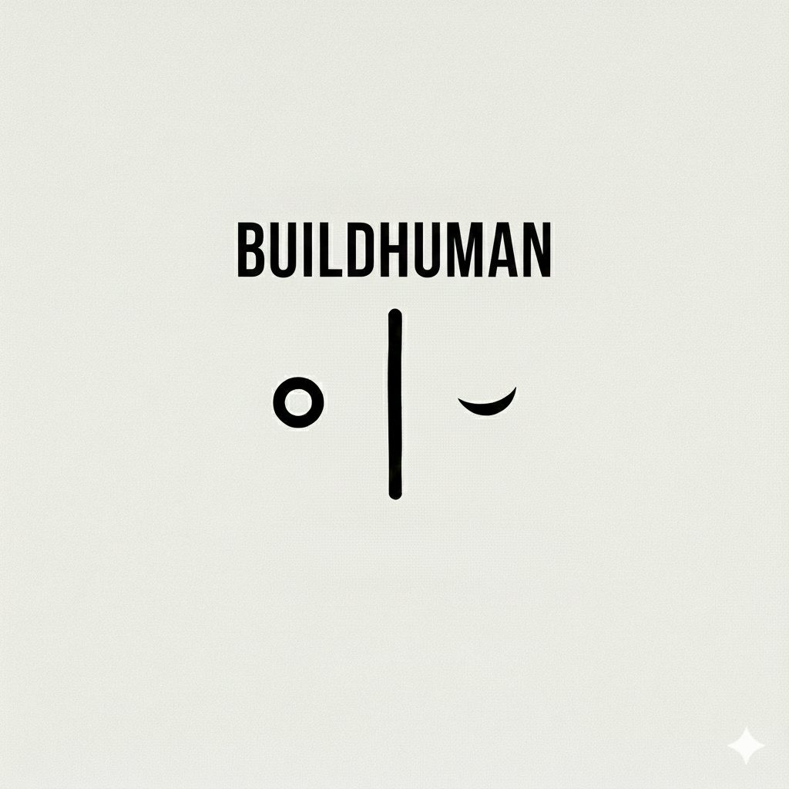

<p align="center">
  
</p>

# BuildHuman

A customizable 3D human generator and asset creation platform built with modern web technologies.

Create realistic human characters with customizable morphs, body types, clothing, and accessories. Export to industry-standard formats for use in games, films, and visualizations.

## Project Structure

```
BuildHuman/
├── app/              # Desktop application (SolidJS + Tauri + Bevy)
│   ├── src/          # SolidJS frontend
│   ├── src-tauri/    # Rust backend with Bevy 3D engine
│   └── dist/         # Build output
│
├── service/          # Python FastAPI asset service
│   ├── main.py       # API server
│   ├── cache/        # Cached assets
│   └── storage/      # Asset files
│
└── README.md         # This file
```

## Features

### Human Generation
- **Parametric Bodies**: Customize height, weight, proportions, muscle definition
- **Morphs & Blend Shapes**: Fine-tune facial features, body shapes
- **Age & Gender**: Generate diverse human characters
- **Real-time Preview**: See changes instantly with Babylon.js renderer

### Asset Library
- **Browse & Download**: Extensive library of clothing, accessories, and body parts
- **Local Cache**: Fast access to downloaded assets
- **Blender Integration**: Edit assets seamlessly in Blender
- **Format Support**: GLB/GLTF for maximum compatibility

### Advanced Features
- **Bevy Integration**: High-performance 3D rendering backend
- **Scene Creation**: Pose and light your characters
- **Batch Generation**: Create variations automatically
- **Export Options**: Export to GLB, FBX, and other formats

## Future Development

BuildHuman may evolve or fork into:
- **Architecture Tools**: Scene and environment creation
- **CAD Integration**: Technical human models for ergonomic design
- **Animation**: Character rigging and motion capture

## Getting Started

### Prerequisites

- **Node.js** 18+ (for the desktop app)
- **Rust** latest stable (for Tauri backend)
- **Python** 3.9+ (for asset service)
- **Poetry** (for Python dependency management)
- **Blender** (optional, for asset editing)

### 1. Run the Asset Service

First, set up and run the Python backend service.

```bash
cd service
poetry install
poetry run poe dev
```

The service will be available at `http://localhost:8000`.

### 2. Run the Desktop App

In a separate terminal, run the desktop application.

```bash
cd app
npm install
npm run tauri dev
```

## Development

This is a monorepo containing both the desktop application and the asset service backend.

### Tech Stack

- **Frontend**: SolidJS, TypeScript, Babylon.js
- **Backend**: Rust, Tauri, Bevy 3D engine
- **Service**: Python, FastAPI
- **3D Formats**: GLB, GLTF

## Contributing

BuildHuman is in active development. Contributions are welcome! Please open an issue to discuss any major changes.

## License

This project is licensed under the GNU General Public License v3.0 or any later version.

It is recommended to create a `LICENSE` file in the root of the project containing the full text of the GPL-3.0 license.

